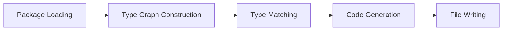
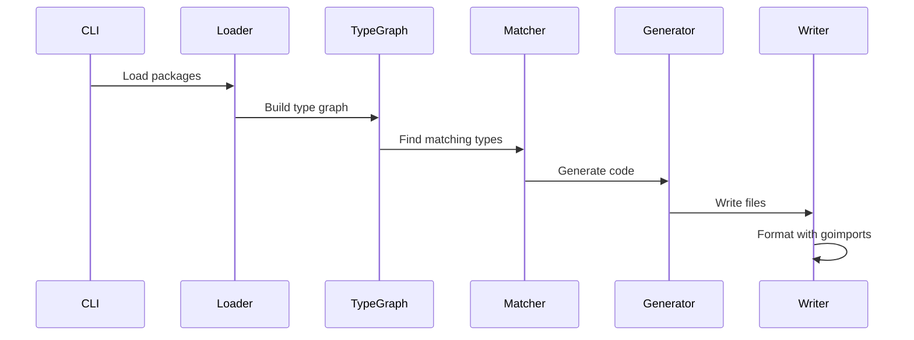

# Architecture Documentation

## System Overview

go-codegen implements a modular code generation system built on Go's AST and type system. The architecture follows a pipeline pattern: **Load → Analyze → Match → Generate → Write**.



## Core Components

### 1. Package Loading Layer (`pkgsutil`, `imports`)

The foundation layer responsible for loading and parsing Go packages.

**Key Components:**
- **`pkgsutil.Load()`**: Wrapper around `golang.org/x/tools/go/packages` 
- **Import Resolution**: Handles complex import paths and build constraints
- **Type Information**: Extracts complete type information including generics

**Design Decisions:**
- Uses `packages.LoadMode` with full type information for accurate analysis
- Supports build flags to handle conditional compilation
- Caches loaded packages for performance

### 2. Type Graph (`typegraph`)

Builds a directed graph of type dependencies across packages.

**Key Concepts:**
- **Nodes**: Represent Go types (structs, interfaces, etc.)
- **Edges**: Represent relationships (embedding, field types, method parameters)
- **Parent/Child**: Tracks type hierarchy and dependencies

**Graph Operations:**
```go
type Graph struct {
    // Maps type to its dependencies
    Parent  map[types.Type][]types.Type
    // Maps type to types that depend on it
    Children map[types.Type][]types.Type
}
```

**Use Cases:**
- Detecting circular dependencies
- Finding all types that need regeneration when a base type changes
- Traversing type relationships for deep operations

### 3. Matcher System (`matcher`)

Determines which types require code generation based on configurable rules.

**Matcher Configuration:**
```go
type MatcherConfig struct {
    ChanMatcher      MatchChan      // How to handle channels
    FuncMatcher      MatchFunc      // How to handle functions
    InterfaceMatcher MatchInterface // How to handle interfaces
    SkipNoCopyTypes  bool          // Skip types with Lock() method
}
```

**Matching Process:**
1. Analyze type characteristics
2. Apply matcher rules
3. Check for directive comments
4. Return decision (generate/skip)

**Special Cases:**
- No-copy types (contain `sync.Mutex` or similar)
- Types with custom clone methods
- Generic type parameters

### 4. Generator Framework (`generator/`)

Abstract generator interface implemented by specific generators.

**Generator Interface Pattern:**
```go
type Generator interface {
    Generate(ctx context.Context, pkgs []*packages.Package) error
    Configure(opts ...Option) error
}
```

**Common Generator Features:**
- AST manipulation using `github.com/dave/dst`
- Template-based code generation
- Directive comment processing
- Import management

### 5. Cloner Generator (`generator/cloner`)

Generates deep clone methods for Go types.

**Architecture:**
```
cloner/
├── generator.go      # Main generator logic
├── method.go         # Method generation
├── matcher.go        # Type matching rules
└── custom_handler.go # Special type handling
```

**Generation Strategy:**
- **Simple Types**: Direct assignment
- **Pointers**: Allocate new and clone pointee
- **Slices/Maps**: Create new, iterate and clone elements
- **Structs**: Field-by-field cloning
- **Interfaces**: Type assertion and delegation

**Generic Handling:**
```go
// Non-generic type
func (t Type) Clone() Type

// Generic type - requires clone functions
func (t Type[T]) CloneFunc(cloneT func(T) T) Type[T]
```

### 6. Undgen Generator Suite (`generator/undgen`)

Generates code for undefined/nullable type handling.

**Sub-generators:**

#### Patch Generator (`gen_patcher.go`)
- Creates types with all fields as optional
- Used for HTTP PATCH operations
- Generates merge methods

#### Plain Generator (`gen_plain.go`)
- Converts between und types and standard Go types
- Bidirectional conversion methods
- Handles nested structures

#### Validator Generator (`gen_validator.go`)
- Generates validation methods
- Checks required fields
- Custom validation rules via tags

### 7. File Writing System (`suffixwriter`)

Manages output file creation with consistent naming.

**Features:**
- Automatic suffix addition (`.clone.go`, `.und_patch.go`, etc.)
- Header injection (DO NOT EDIT notice)
- goimports integration for formatting
- Atomic file operations

**Writer Pipeline:**
```go
Writer.Write() → AddSuffix() → AddHeader() → Format() → WriteFile()
```

### 8. Directive Comments (`codegen/directive_comment.go`)

Processes special comments that control generation behavior.

**Comment Types:**
```go
//cloner:skip         // Skip this type
//cloner:copyptr      // Copy pointer instead of dereferencing  
//undgen:ignore       // Ignore this field
//codegen:generated   // Mark as generated
```

**Processing Flow:**
1. Parse AST comments
2. Extract directives
3. Apply to generation logic
4. Preserve in generated code where appropriate

## Data Flow

### Generation Pipeline



### Type Analysis Flow

1. **Package Loading**: Load target packages with full type information
2. **AST Walking**: Traverse AST to find type declarations
3. **Type Graph Construction**: Build relationships between types
4. **Matching**: Apply rules to determine generation targets
5. **Code Generation**: Generate appropriate methods/types
6. **Import Resolution**: Ensure all imports are included
7. **File Writing**: Write formatted output with proper suffixes

## Design Patterns

### 1. Visitor Pattern
Used for AST traversal and modification:
```go
ast.Inspect(node, func(n ast.Node) bool {
    // Process node
    return true
})
```

### 2. Builder Pattern
For constructing complex generated code:
```go
builder := NewMethodBuilder().
    WithReceiver(typ).
    WithName("Clone").
    WithBody(body).
    Build()
```

### 3. Strategy Pattern
Different strategies for different type kinds:
```go
var cloneStrategies = map[reflect.Kind]CloneStrategy{
    reflect.Slice: sliceCloner,
    reflect.Map:   mapCloner,
    reflect.Ptr:   ptrCloner,
}
```

### 4. Template Pattern
Base generator with customizable steps:
```go
func (g *BaseGenerator) Generate() {
    g.prepare()
    g.analyze()
    g.generate()
    g.write()
}
```

## Performance Considerations

### Optimization Strategies

1. **Package Caching**: Cache loaded packages to avoid reloading
2. **Parallel Processing**: Process independent packages concurrently
3. **Buffer Pooling**: Reuse buffers for string building
4. **Lazy Loading**: Load type information only when needed

### Bottlenecks and Solutions

| Bottleneck | Solution |
|------------|----------|
| Large codebases | Incremental generation |
| Deep type nesting | Depth limiting with cycle detection |
| Import resolution | Import caching |
| File I/O | Batch writing, buffering |

## Extension Points

### Adding New Generators

1. Implement the `Generator` interface
2. Add CLI command in `cmd/`
3. Define file suffix in `suffixwriter`
4. Add tests in `internal/tests/`

### Custom Type Handlers

Register custom handlers for specific types:
```go
RegisterCustomHandler("time.Time", timeCloneHandler)
```

### Directive Extensions

Add new directive types:
1. Define in `directive_comment.go`
2. Parse in generator
3. Apply in generation logic

## Security Architecture

### Constraints

1. **Path Security**: All paths must be relative to working directory
2. **No Code Execution**: Generated code is never executed during generation
3. **Input Validation**: All user inputs are validated
4. **File Permissions**: Respects file system permissions

### Trust Boundaries

```
User Input → Validation → Generator → Output Files
     ↑                                      ↓
     └──────── No direct execution ─────────┘
```

## Testing Architecture

### Test Levels

1. **Unit Tests**: Test individual components
2. **Integration Tests**: Test generator pipeline
3. **Generation Tests**: Generate and compile test code
4. **End-to-End Tests**: Full command execution

### Test Organization

```
internal/
├── generationtests/   # Tests that generate code
│   └── _generate_test/
├── tests/             # Unit and integration tests
└── testtargets/       # Sample input files
    ├── simple/        # Simple test cases
    ├── complex/       # Complex scenarios
    └── edge/          # Edge cases
```

## Future Architecture Considerations

### Planned Improvements

1. **Plugin System**: Dynamic generator loading
2. **Language Server**: IDE integration via LSP
3. **Incremental Generation**: Only regenerate changed types
4. **Cross-Language**: Generate bindings for other languages

### Scalability Considerations

- **Monorepo Support**: Handle very large codebases
- **Distributed Generation**: Split work across machines
- **Caching Layer**: Persistent cache between runs
- **Watch Mode**: Auto-regenerate on file changes